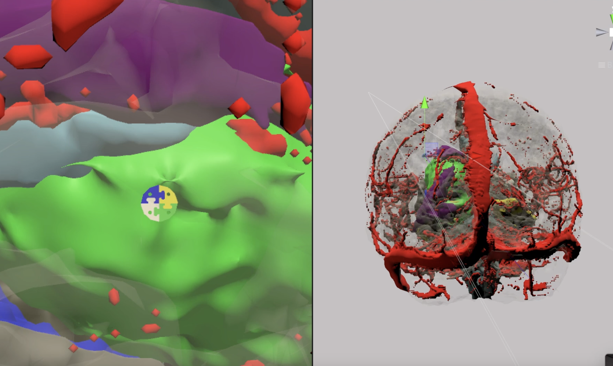

# Reinforcement_learning_path_planning

ITA

Gli algoritmi di pianificazione del percorso per gli aghi orientabili devono essere in grado di garantire l'evitamento degli ostacoli anatomici e la minimizzazione della curvatura. Devono studiare la sequenza di pose necessarie per spostare l'agente da una posizione di partenza a una di arrivo, sia nello spazio che nel tempo. Attualmente la maggior parte dei metodi più diffusi in letteratura presenta grandi limitazioni, in particolare l'impossibilità di ottenere direttamente traiettorie lisce. In questo lavoro proponiamo un approccio di apprendimento per rinforzo per addestrare un modello di catetere per la neurochirurgia mini-invasiva in un ambiente simulato sia per le fasi pre- che intra-operatorie. Per questo progetto, Soft Ac-tor Critic (SAC) e Generative Adversarial Imitation Learning (GAIL) sono gli algoritmi valutati e confrontati in un ambiente statico e dinamico.

ENG

Path planning algorithms for steerable needles mustbe able to guarantee anatomical obstacles avoidance and minimiz-ing the curvature. They have to investigate the sequence of posesneeded to move the agent from a starting position to a targetone, both in space and time. Currently in literature most commonmethods carries great limitations, especially the impossibility todirectly obtain smooth trajectories. In this work we proposea reinforcement learning approach to train a catheter modelfor minimally-invasive neurosurgery in a simulated environmentboth for pre- and intra-operative phases. For this project Soft Ac-tor Critic (SAC) and Generative Adversarial Imitation Learning(GAIL) are the algorithms evaluated and compared in a staticand in a dynamic environment.
